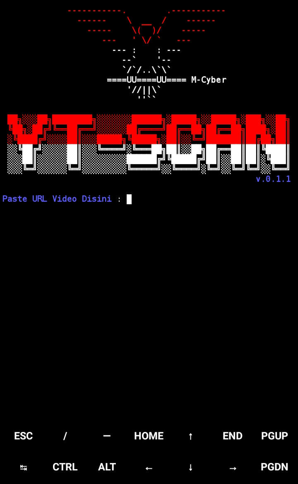

# YT-SCAN
##### ©Created by M-Cyber 🔐

# APA ITU YT-SCAN?

* YT-SCAN adalah sebuah Tools/Alat untuk mengambil informasi dari sebuah url/link dari video YouTube!
* YT-SCAN bisa menjadi alat untuk scraping video YouTube❗
## APA FITUR DI DALAMNYA❓
#### [ + ] informasi yang bisa kalian dapatkan!
* Nama Channel
* ID Channel 
* Url Channel 
* Deskripsi
* Tag
* Tanggal upload 
* Jumlah Views/penayangan!
* Usia (sedikit bug)
* Panjang Video complete
* Rating
* Thumbnail url ⚠️
#### Fitur canggih dari YT-SCAN ini adalah : Pengambilan Thumbnail YouTube 🤫
#
### PENGINSTALAN 🚀
* Termux
* Kali Linux 
#
# Untuk Termux ❗
#### Install dependensi yang diperlukan 
### update dan upgrade Termux 
```
apt update && apt upgrade
```
### Install Python 
```
apt install python -y 
```
### Install Git
```
apt install git -y 
```
### Clone repository YT-SCAN 
```
git clone https://github.com/M-Cyber7/YT-SCAN
```
### Masuk ke direktori YT-SCAN 
```
cd YT-SCAN
```
### Install modul yg diperlukan YT-SCAN 
```
python install.py
```
### Jalankan YT-SCAN 
```
python yt-scan.py
```
### Done 🔥
#
 __________________
#
# KALI LINUX ❗
### Clone repository
```
git clone https://github.com/M-Cyber7/YT-SCAN
```
### Masuk ke direktori
```
cd YT-SCAN 
```
### install modul secara manual
```
pip install pytube requests
```
### Jalankan Tools 
```
python yt-scan.py
```
#
##### Masih Terdapat sedikit Bug pada Tools!
##### Mohon laporkan bug kepada pembuat melalui Media
* [TikTok](https://tiktok.com/@educationm_cyber_29)
* [Facebook](https://www.facebook.com/profile.php?id=61551079130055)
* [Instagram](https://instagram.com/codingindonesia_?utm_source=qr&igshid=MzNlNGNkZWQ4Mg%3D%3D)
# Panduan untuk Pengguna 🔐

## Perhatian: 
**Penting untuk Diperhatikan Sebelum Menggunakan YT-SCAN**

YT-SCAN adalah alat pengembangan untuk tujuan pendidikan. Penggunaan alat ini untuk aktivitas ilegal atau tanpa izin adalah melanggar hukum. Pengguna bertanggung jawab sepenuhnya atas tindakan mereka sendiri.

**Dilarang keras:**
- Menggunakan YT-SCAN untuk mencuri informasi atau tindakan merugikan terhadap orang atau sistem.
- Mengakses data tanpa izin atau melakukan tindakan yang melanggar privasi.

Pengguna yang tidak mematuhi pedoman etika dan hukum akan bertanggung jawab atas tindakan mereka sendiri.

Dengan menggunakan YT-SCAN, Anda setuju untuk mengikuti pedoman dan peraturan yang berlaku di wilayah hukum Anda.

Silakan gunakan YT-SCAN dengan bijak dan sesuai dengan hukum setempat.
#
### Dengan mengikuti langkah-langkah tersebut dengan baik, Maka anda dapat menjalankan YT-SCAN dengan baik juga 🔐
### Selamat Mencoba 🚀
#
#
#### Thanks 🇮🇩
#
